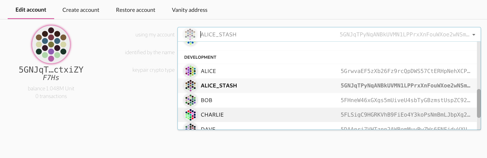

# Polkadot-devnet

## Quick start

Make sure you have `docker` and `docker-compose` installed on your system.

```
git clone https://github.com/lsaether/polkadot-devnet.git
cd polkadot-devnet
docker-compose up
```

Open the [Polkadot Dashboard](https://polkadot.js.org/apps) and go to the `Settings` tab. Change the `remote node/endpoint to connect to` option to point to `Local Node (127.0.0.1:994)`.

The Dashboard should automatically pick up the development accounts, check the dropdown in the `Accounts` tab. (Hint: `ALICE_STASH` has all the funds).

